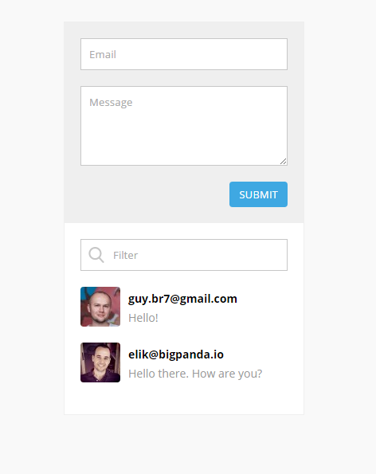

## Reactive Comments (BigPanda home exercise)
A Node/Vue/Redis app that shows a comments snippet.

## Live demo
Check it out [here](https://guyb7.com/bigpanda-exercise/).

## How it looks

## How to run it
* clone this repo
* install yarn (or npm)
* install node (tested on 7.5.0)
* install and run redis on port 6379 (tested on 3.2)
* run `yarn install`
* run `yarn start`
* open `http://localhost:3000/` in your browser

## Delete all comments endpoint
Make a GET request to `http://localhost:3000/api/feed/destroy`

## Notes
* It will create a sorted set on your local redis instance (`bigpanda-exercise-guyb7-comments`), use the destroy endpoint above to get rid of it
* Added fake latency for API calls
* No tests whatsoever (as instructed)

The codebase is rather simple, but I'll throw in a short explanation anyway.

The main entrypoint is `server.js` which starts an Express app, serves the static files under `/public` and listens for the `/api` requests.

The client-side app is loaded in `/public/index.html` and is actually contained in a single file - `/public/app.js`. I didn't split it into individual files as it's a rather small app and there's no build process.

If you're not familiar with Vue, just think of it as React with HTML strings instead of JSX.
